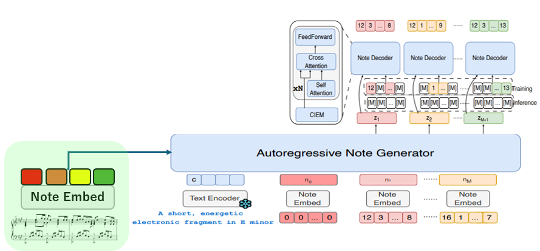

## 🏗️ Model Architecture
<p align="center">
  
</p>


## モデル修正点
入力譜面全体をテキストプロンプト前にconcatして生成
⇒譜面編曲モデルの実現


## コード修正部分
### Amadeus_app_EN.py
- generate_with_text_prompt
入力譜面の音符属性シーケンス列入力
```python
file_path = "dataset/represented_data/tuneidx/tuneidx_test/nb8/sample.npz"  # 読みたい npz ファイルのパス
data = np.load(file_path)
input_note = data['arr_0']
input_note = torch.tensor(input_note, dtype=torch.long).to(device)
```

### model_zoo.py
- AmadeusModelAutoregressiveWrapperクラスのgenerate
入力譜面の埋め込み、テキストプロンプトとのconcat
```python
if input_note is not None:
    # input_note shape: [batch_size, num_notes, 8] or [num_notes, 8]
    if len(input_note.shape) == 2:
      input_note = input_note.unsqueeze(0)  # [1, num_notes, 8]
    
    # Add positional encoding
    note_embedding = self.net.input_embedder(input_note) + self.net.pos_enc(input_note)
    note_embedding = self.net.emb_dropout(note_embedding)
    
    # === Concatenate with text context ===
    if context is not None:
      # context: [batch_size, text_seq_len, dim]
      # note_embedding: [batch_size, num_notes, dim]
      context = torch.cat([note_embedding, context], dim=1)  # [batch_size, text_seq_len + num_notes, dim]
    else:
      context = note_embedding
```
